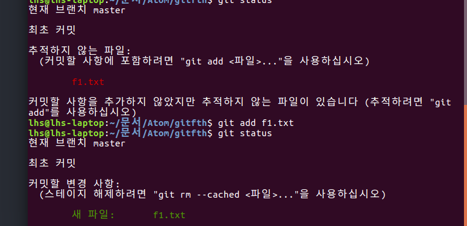
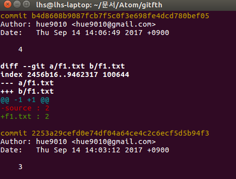

현재 디렉토리를 git의 (버전) 저장소로 만든다.
```
git init
```
.git 디렉토리가 생기고 버전관리를 하게되면서 생기는 정보들은 해당 디렉토리에 저장된다. 즉, 지우면 안된다.

---
프로젝트 폴더의 상태를 확인한다.
```
git status
```
  

---
git이 파일을 추적하라고 명령 한다.
```
git add f1.txt
```

---
```
git config --globla user.name myName
git config --globla user.email myEmail
```

```
git commit
```
```
만약 vim이 아니라 nano와 같은 에디터가 실행되면 아래 명령을 사용하시면 됩니다.
git config --global core.editor "vim"  
```

git에서 어떤 새로운 파일이 생겼을때 그 파일에 대한 버전관리를 명령할때도 add,
최초의 추적때도 add, 파일이 수정되서 버전을 만들기 전에도 add를 해야한다.

**git은 commit 전에 add를 꼭해야 한다.** 그 이유는 선택적으로 파일을 버전에 포함시키기 위해서다. **버전은 의미 있는 변화를 말한다.**

git은 add라는 과정을 통해서 commit을 하고 싶은 파일만 commit 할 수 있다.(add를 한 파일만 commit이 된다. 선택적으로 커밋이 된다.)

---

로그에서 출력되는 버전 간의 차이점을 출력하고 싶을 때
```
git log -p
```
  

+로 되어 있는 곳이 최신 버전, -가 이전 내용

---
버전 간의 차이점을 비교할 때
```
git diff '버전 id'..'버전id2'
```

git add하기 전과 add한 후의 파일 내용을 비교할 때
```
git diff
commit을 하기 전에 내가 한 작업이 제대로 됐는지 리뷰를 할 수 있다.
```
---
아래 명령은 버전 id로 돌아가는 명령이다.
```
git reset --hard "버전id"
git reset "버전id" --hard
(둘다 가능)
```

버전 id의 커밋을 취소한 내용을 새로운 버전으로 만드는 명령
```
git revert "버전 id"
```

commit 명령어에 대한 도움말을 볼 수 있다.(다른 명령어도 가능)
```
git commit --help
```
수정하거나 삭제한 파일을 자동으로 스테이지에 올리고, "message" 부분을 commit 메시지로 쓴다.
```
git commit -am "message"
```
