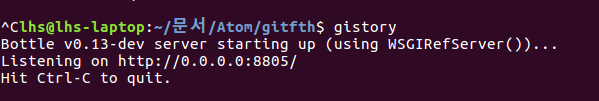
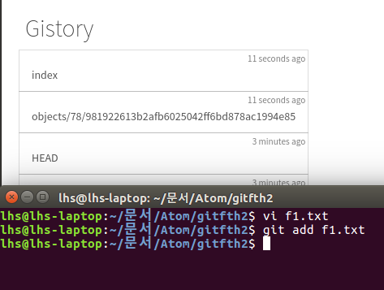
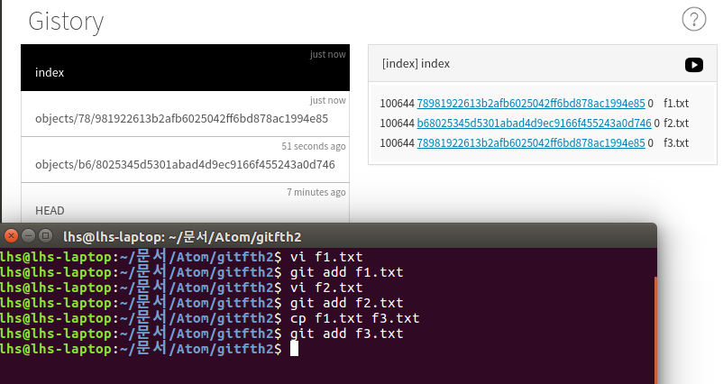
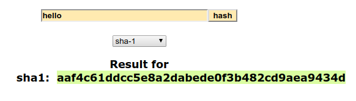
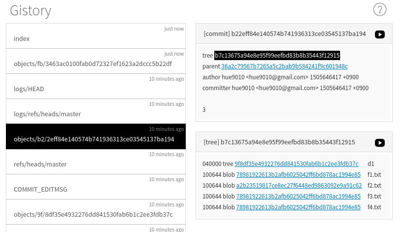
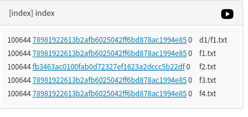
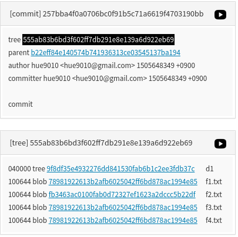

git의 원리
=========
1. 원리에 대한 궁금증은 인간의 본능이다.

2. 종종 어떤 원리들은 그것이 원리이기 때문에 어려울 것이라고 오해를 받는다. 또 어떤 공부들은 원리를 모르면 공부하는데 10시간이 걸리는데 조금 지나면 잊어버리는 것이 있다. 반면에, 1시간동안 원리를 배우면 공부하는데 3시간 밖에 걸리지 않고, 훨씬 오래 기억되기도 한다.

3. git이 동작하는 원리를 알면 우리도 git과 같은 것을 배울 수 있다. git의 명령어만 배우면 단지 git의 사용자가 될 뿐이다. 하지만 원리를 배우면 우리도 무엇인가를 만드는데 큰 영감을 얻을 수 있다.

---
gitstory 설치
=============
```
pip install gitstory
pip3 install gitstory
```
.git이 있는 폴더로 가서
```
gitstory
```
  <실행 화면>
  

---

<add 후 Gistory의 변화>  

파일의 이름은 index에 파일의 내용은 object에 있다.

git은 파일을 저장 할 때 파일의 이름이 달라도 파일의 내용이 같으면 같은 오브젝트를 가리킨다.


```
100644 78981922613b2afb6025042ff6bd878ac1994e85 0	f1.txt
100644 78981922613b2afb6025042ff6bd878ac1994e85 0	f3.txt
```

---
objects 파일명의 원리
===================
git은 파일의 내용 기반으로 object 파일의 이름을 만든다. 이것 덕분에 git은 매우 효율적으로 중복 데이터를 저장할 수 있다. 여기는 그 원리인 [SHA1 hash](http://www.sha1-online.com/)에 대해서 알아본다.

git은 우리가 저장한 우리가 저장한 파일의 내용을 SHA1이라는 hash 알고리즘을 통과시켜서 파일의 이름을 도출 한 다음 그 파일의 이름, 즉 hash 정보에서 두 글자를 따서 object 디렉토리 밑에다가 디렉토리를 만들고 다음 문자들로 파일을 만들어서 정보를 저장 한다.

  >  

  >**aa**f4c61ddcc5e8a2dabede0f3b482cd9aea9434d   
  >aa가 디렉토리 이름이 된다.  

  >aa**f4c61ddcc5e8a2dabede0f3b482cd9aea9434d**  
  >f4~4d가 파일 이름이 된다.

git은 sha1을 쓰지만 부가적인 정보는 달라도 위와 같은 방식으로 작동 한다.  

예를 들면 우리가 'a'라는 내용이 있는 파일을 add 하면 파일의 내용을 봐서 a라는 정보와 부가적인 정보를 추가해서 압축한다. 그 다음 sha1 방법으로 생긴 hash의 값을 통해 디렉토리와 파일을 만들고 내용을 저장한다. 그 다음 index라는 파일에 f1.txt의 내용은 이것이다라고 저장한다.

---
commit의 원리
============

commit 메시지에 해당하는 정보 또한 objects 디렉터리에 들어간다. 즉 버전도 objects에 들어간다. commit도 객체로(object) 본다.

    

###commit에는 중요한 정보가 두가지 있다.
 - 이전 커밋이 누구인가 부모를 나타내는 **parent**가 있다.

 - 커밋이 일어난 시점에 작업 디렉토리에 있는 파일의 이름과 그 파일의 이름이 담고있는 내용 사이에 정보가 **tree**에 담겨있다.  

 각각의 버전마다 서로 다른 tree를 가지고 있고 tree마다 파일의 이름과 내용이 각각 링크 되어 있기 때문에 tree를 통해서 그 버전이 만들어진 시점에 그 프로젝트 폴더에 대한 상태를 얻어낼수 있다. 각각의 버전은 해당 버전이 만들어진 시점의 snapshot을 tree라는 정보구조를 통해서 가지고 있다.  

각각의 커밋의 tree에는 commit이 만들어진 시점의 파일의 이름들과 내용이 담겨 있다.

objects에 들어가있는 파일들은 object다(객체)

###object의 세가지 구성요소
- blob: 파일의 내용을 담고 있다.

- tree: 어떤 디렉터리에 파일명과 내용에 해당하는 blob을 담고 있다.

- commit: 각각의 object 아이디를 가지고 있다.

---
git status
===========


index라는 파일과 현재 우리의 최신 commit. 이 두가지를 비교하면 add, commit 할 것이 있는지 아닌지 알 수 있다.
>\<index 내용>  
>   

>\<commit 내용>  
>

인덱스의 내용과 가장 최신 커밋의 트리의 내용이 일치하면 현재 add, commit 할 것이 없는 것이다.  

**<working directory - index, staging area, cache - repository>**   
    

  (출처: https://stackoverflow.com/questions/3689838/difference-between-head-working-tree-index-in-git)
