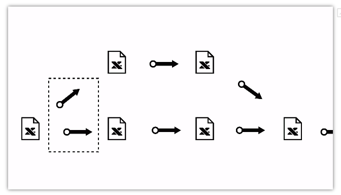
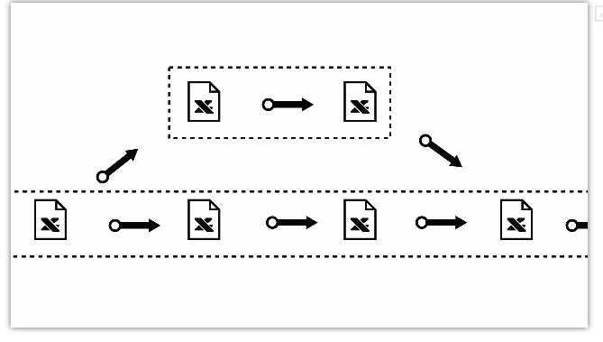
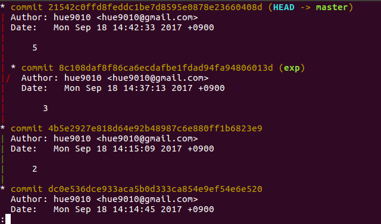
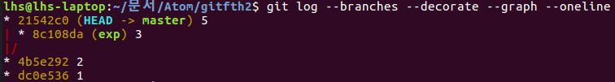
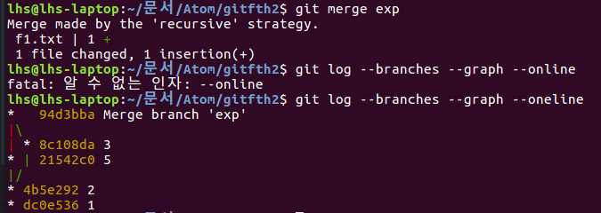
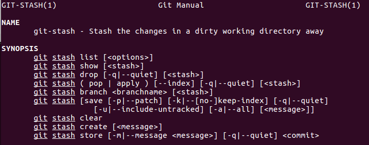

git의 혁신 - branch
===================
branch는 가지라는 뜻으로 작업을 분기해서 처리하는 경우에 대한 시적인 표현  

**<branch가 추가되는 상황>**  

**<두 개의 branch가 존재>**  

---
branch 만들기
============

git의 기본 branch는 'master'다

브랜치의 목록을 볼 때
>git branch

브랜치를 생성할 때
>git branch "새로운 브랜치 이름"

브랜치를 삭제할 때
>git branch -d

병합하지 않은 브랜치를 강제 삭제할 때
>git branch -D

브랜치를 전환(체크아웃)할 때
>git checkout "전환하려는 브랜치 이름"

브랜치를 생성하고 전환까지 할 때
>git checkout -b "생성하고 전환할 브랜치 이름"

---
branch 정보확인
==============

브랜치 간에 비교할 때
>git log "비교할 브랜치 명 1".."비교할 브랜치 명 2"

브랜치 간의 코드를 비교 할 때
>git diff "비교할 브랜치 명 1".."비교할 브랜치 명 2"

로그에 모든 브랜치를 표시하고, 그래프로 표현하고, 브랜치 명을 표시하고, 한줄로 표시할 때
>git log --branches --graph --decorate   --oneline    

**<online 옵션이 없을때>**
  

**<online 옵션이 있을때>**

online 옵션을 주면 한 줄로 현재 상태를 보여준다

---
branch 병합
===========

A 브랜치로 B 브랜치를 병합할 때 (A ← B)
>git checkout A  
>git merge B

  

merge 수행 후 합쳐진다.

---
branch 수련
===========

[브랜치와 Merge의 기초(pro git)](https://git-scm.com/book/ko/v2/Git-%EB%B8%8C%EB%9E%9C%EC%B9%98-%EB%B8%8C%EB%9E%9C%EC%B9%98%EC%99%80-Merge-%EC%9D%98-%EA%B8%B0%EC%B4%88)

강의에 나온 중요할 것 같은 키워드: 3-way Merge

---
branch 병합 시 충돌 해결
=====================
*(이번 스크린샷은 영어 문구 그대로 보고자 생활코딩의 사진을 활용 했습니다.)*   
같은 부분을 수정하면 문제가 생긴다.  

**<충돌이 일어났을 때>**  

충돌이 생기면 아래와 같은 메시지가 뜬다.  

git status를 하면 충돌이 일어난 파일을 찾을 수 있다.  

충돌이 발생한 파일을 수정합니다. 아래와 같습니다.

'<<<<<<< HEAD' 부터 '=======' 사이의 구간이 현재 체크 아웃된 파일의 내용이고 '=======' 부터 '>>>>>>> exp' 사시의 구간이 병합하려는 대상인 exp 브랜치의 코드 내용이다.  이 정보를 참고로해서 두개의 코드를 병합한 후에 특수기호들을 제거해주면 된다. 작업이 끝나면 파일을 저장.

충돌 작업을 끝냈다는 것을 깃에게 알려줍니다.

> git add 'conflicted file name'

---
stash
======
stash는 감추다 숨겨두다라는 뜻  

working directory안의 내용을 대상으로 한다. 즉, 버전관리 되고 있는 파일들만 해당 된다.

>다른 브랜치로 checkout을 해야 하는데 아직 현재 브랜치에서 작업이 끝나지 않은 경우는 커밋을 하기가 애매합니다. 이런 경우 stash를 이용하면 작업중이던 파일을 임시로 저장해두고 현재 브랜치의 상태를 마지막 커밋의 상태로 초기화 할 수 있습니다. 그 후에 다른 브랜치로 이동하고 작업을 끝낸 후에 작업 중이던 브랜치로 복귀한 후에 이전에 작업하던 내용을 복원할 수 있습니다. 여기서는 이 기능에 대해서 알아봅니다.

