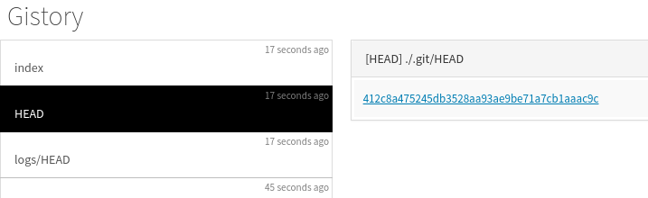

branch의 원리
=============
```
깃을 처음 만들면 **HEAD** 파일이 반드시 생기고 이 HEAD 파일은 **master** 파일을 가리킨다.
master 파일은 **최신 커밋**을 가리킨다.

> HEAD -> master -> 최신 commit
```

깃을 초기화 하면 **HEAD 파일**을 가지게된다. HEAD 파일은 **refs/heads의 파일(처음엔 master)**을 가리키고, 이 파일은 가장 최근에 commit한 **commit의 object 아이디 값**을 가지고 있다.
> HEAD -> master -> 최신 commit

  


##\<git log>

그래서 'git log'는 HEAD파일을 보고, HEAD파일은 master 파일을 보고, master파일은 object 아이디 값을 봐서 가장 최근의 commit을 알수 있다. 그 이후 parent를 보고 이전 작업들을 탐색해 나갈수 있다.

  

##branch  

깃 에서 브랜치라고 하는것은 refs 밑에 있는 파일을 의미한다.  
>'git branch exp' 이후 '.git/refs/heads' 폴더 내부의 파일들  
>
> 
>
>   

즉, 'git checkout branch이름'을 후 HEAD가 가리키는 파일이 변경되는 것이다.

  

또한 git log시 보이는 **HEAD->master**는 HEAD 파일이 무엇을 가리키고 있는지를 나타내는 것이다.

  


####branch는 중요하고 강력한 기능이지만 사실은 텍스트파일 하나 일뿐이다.


---
reset과 checkout의 원리
======================

- reset을 한다는것은 지금 우리가 checkout한 branch의 최신 commit을 바꾸는 행위이다.


- git은 왠만해서는 파일을 지우지 않는다. 파일이 많아지면 가비지 컬렉션이 돌지만 왠만해선 안한다.

- /logs/refs/heads/master는 mater brahcn에서 일어나는 여러 사건들을 기록하는 log다.

###reset 수행 후 해당 파일의 내용을 보면

  

현재 내용은 4번 commit을 3번 commit으로 move했다는 내용이 있다.

> git reflog

위 명령어를 수행하면 logs/HEAD의 내용을 볼수 있다.

  


reset을 취소하고 싶다면 해당 파일 내용을 참고하면 된다.

###ORIG_HEAD

ORIG_HEAD는 뭔가 위험한 명령들을 하기전에 최신 branch에 HEAD가 가리키고 있는 commit을 기록해 둔다. 그래서 이걸 이용해서도 방금 작업한 명령을 취소할수 있다.  

  

>git reset --hard ORIG_HEAD


###직접 branch commit이름을 통해서도 HEAD를 변경 시킬 수 있다.

  

  

직접 커밋을 가리키고 있다.

---
reset으로 알아보는 working copy, index, repository
======================================


**<option에 따른 범위>**  

(출처: [생활코딩](https://s3-ap-northeast-2.amazonaws.com/opentutorials-user-file/module/2676/5131.png))  

>--hard  

  위험하지만 가장 심플하다.

###working directory
  >실제 작업을 진행 하는 곳

###index  
  >우리가 git add를 하면 포함 되는 곳  
###repository   
  >실제 우리의 commit들이 저장되는 곳(광범위하게 사용되는 의미이기 때문에, 문맥에따라 해석해야 한다.)
(옵션을 생략하면 mixed다)

---
merge & conflict의 원리
=======================

###conflict시 내용  
  

###conflict시 index 내용
  
- 1번은 원본 파일
- 2번은 merge를 하는 branch의 파일
- 3번은 병합이 될 대상이다

###병합을 전문적으로 하는 툴들이 있다.
- kdiff3

- bc(beyond compare)

###병합 툴 등록
```
git config --global merge.tool kdiff3
git config --global merge.tool bc
```

지금 생긴 충돌에 대해 등록한 mergetool을 이용해 병합을 시킨다.
```
git mergetool  
```

---
3 way merge
============

###3 way merge
  
(출처: [생활코딩](https://s3-ap-northeast-2.amazonaws.com/opentutorials-user-file/module/2676/5133.png))  

3개의 파일로 conflict의이 난곳을 판단한다. ?의 위치가 conflict의이 발생한 위치이고 나머지는 자동으로 merge 된다.

###2 way merge
  

두개의 파일로만 conflict의이 난 곳을 판단 한다.
