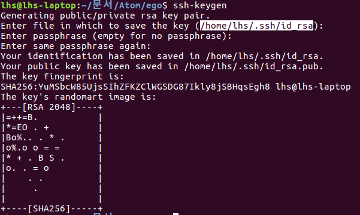
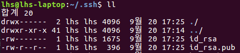
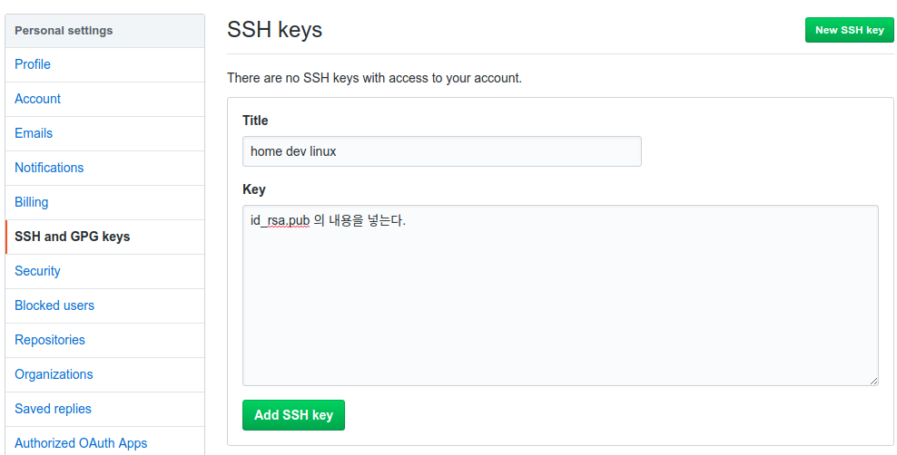

원격 저장소
=========

###지역 저장소  
> 우리가 작업하는 곳

###원격 저장소
> 지역 저장소와 연결되어 동기화 되는 곳, 일반적으로 연격 저장소는 같은 컴퓨터에 있지 않고, 인터넷을 통해 서로 연결된다.  

```
git init --bare
```
우리가 작업을 할수 없고 저장만 할 수 있는 저장소를 만드는 것, working 디렉토리가 없다.

원격 저장소는 작업이 불가능하다.(bare 옵션)

```
git remote add origin /home/lhs/문서/Atom/ego/remote
```
해당 로컬 저장소를 뒤 경로와 연결한다. origin은 경로의 별명이 되는것이다.

```
git remote -v
```
연결된 원격 저장소 보기  

```
git push origin master
```
우리가 orgin에 master라는 branch로 push하겠다는 것.

```
git push --set-upstream origin master
```
앞으로 master 브랜치에서 push 명령을 내리면 origin으로 push를 하겠다고 명시적으로 연결을 세팅하는 옵션

---
원격 저장소를 지역 저장소로 복제(Github)
===================================

git의 소스코드를 지역저장소로 가져오기
```
git clone https://github.com/git/git.git
```

로그를 거꾸로 출력하기
```
git log --reverse
```
git의 첫번째 커밋으로 체크아웃하기
```
git checkout e83c5163316f89bfbde7d9ab23ca2e25604af290
```

---
원격 저장소 만들기(Github)
=======================

###remote
```
git remote add origin https://github.com/Hue9010/gitfth.git
```
현재 로컬 저장소를 origin이라는 이름으로 해당 url로 연결한다.  

###origin
관례적으로 나의 로컬저장소와 연결되어 있는 기본이 되는 원격 저장소

```
git remote remove friend
```
friedn라고 등록되어 있는 원격 저장소를 지운다.

###push
로컬 저장소를 기준으로 나의 작업을 원격저장소를 보내는걸 push라고 표현한다.(동기화)  

```
git push -u origin master
```
-u 옵션은 push를 자동적으로 origin master을 기본값으로 하겠다는 것.

###clone
```
git clone https://github.com/Hue9010/gitfth.git 폴더이름
```
원격 저장소의 내용을 처음 받아올때 쓴다. 뒤에 폴더 이름을 입력하면 해당 이름의 폴더로 clone받는다.

---
원격 저장소와 지역 저장소의 동기화 방법(Github)
========================================

```
git commit --amend
```
마지막 메시지를 바꿀수 있다. 단 원격 저장소에 올리기전에 해야 한다.

지역저장소에 있는 내용은 그것이 자신의 컴퓨터에 있는 경우에만 해야한다.

```
git pull
```
원격저장소에 있는 내용을 지역저장소로 가져온다.


---
로그인 없이 원격 저장소 이용하기(Github)
==================================

###**S**ecure **Sh**ell
```
ssh-keygen
```
ssh를 통해서 다른 컴퓨터로 접속할수 있는 비밀번호가 생긴다.(기계적으로 만들며 현재 기술로는 절대 뚫을수 없다.)  

  

키가
>/home/lhs/.ssh/   

해당 경로에 생성된다.

  

###id_rsa: private key  
- 비밀번호가 저장되어 있다. 우리의 컴퓨터에 저장한다.(절대 노출 하지 말것)  

###id_rsa.pub: public key  
- 비밀이 아닌 공개된 정보가 들어있다. 카피하여 접속할 컴퓨터의 일정한 디렉토리에 넣는다.


github의 setting에 들어가서  

  

해당 폼에 id_rsa.pub의 내용을 복사하여 Add 한 뒤 ssh를 통해 clone 받으면
이후 부터는 ssh를 통해 아이디&비번 입력 없이 push가 가능해진다.
