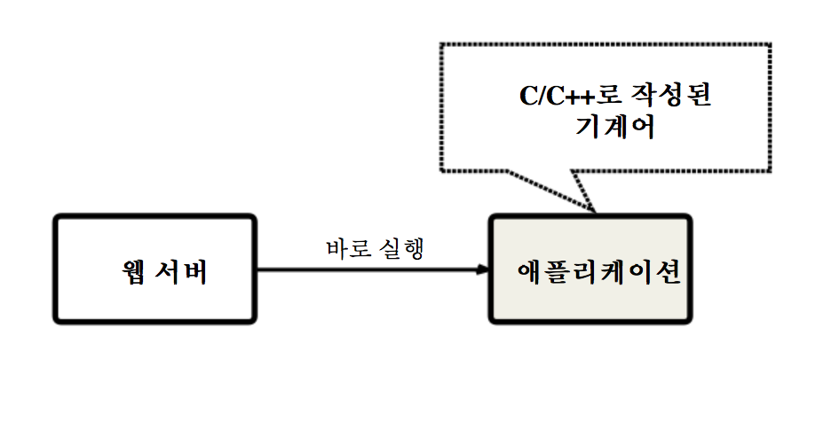

CGI
----

- CGI(Common Gateway Interface)
- 웹 서버와 프로그램 사이의 데이터를 주고받는 규칙
- 웹 서버에 의해 실행되며 CGI 규칙에 따라서 웹 서버와 데이터를 주고 받도록 작성된 프로그램을 'CGI프로그램'이라고 한다

- 컴파일 방식은 기계어로 번역된 코드를 바로 실행하기 때문에 실행 속도가 **빠르지만**, 변경 사항이 발생할 때 마다 다시 컴파일 하고 **재배포**해야 하는 문제가 있다.

- 스크립트 방식은 실행할 때마다 소스 코드의 문법을 검증하고 해석해야 하기 때문에 실행 속도가 **느리다.** 하지만 변경 사항이 발생하면 단지 **소스 코드를 수정하고 저장만 하면 되기 때문에 편리**하다.

서블릿
-----
