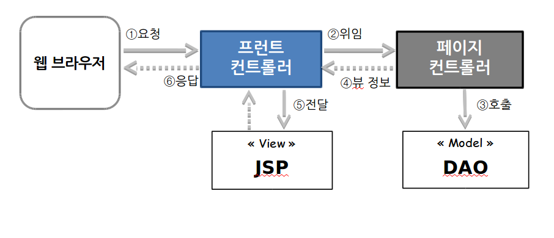
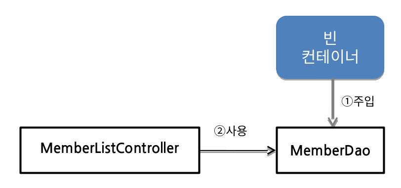

Chapter06 - 미니_MVC_프레임워크_만들기
=========================
- 프런트 컨트롤러
- 페이지 컨트롤러
- DI를 이용한 빈 의존성 관리
- 리플랙션 API를 이용하여 프런트 컨트롤러 개선
- 프로퍼티를 이용한 객체 관리
- 애노테이션을 이용한 객체 관리

---
프런트 컨트롤러
-------------  

    

  1. 웹 브라우저에서 요청이 들어오면, 프런트 컨트롤러에서 그 요청을 받는다. 프런트 컨트롤러는 VO객체를 생성하여 클라이언트가 보낸 데이터를 담는다. 그리고 ServletRequest 보관함에 VO 객체를 저장한다. 요청 URL에 따라 페이지 컨트롤러를 선택하여 실행을 위임한다.

  2. 페이지 컨트롤러는 DAO를 사용하여 프런트 컨트롤러로부터 받은 VO 객체를 처리한다.

  3. DAO는 페이지 컨트롤러로부터 받은 데이터를 처리한다.

  4. DAO 호출이 끝나면, 페이지 컨트롤러는 화면을 만들 때 사용할 데이터를 준비한다. 그리고 JSP가 사용할 수 있도록 ServletRequest 보관소에 저장한다. 프런트 컨트롤러에게 화면 출력을 담당할 뷰 정보(JSP의 URL)를 반환한다.

  5. 프런트 컨트롤러는 페이지 컨트롤러가 알려준 JSP로 실행을 위임한다. 만약 오류가 발생하면 '/Error.jsp'로 실행을 위임한다.

  6. JSP는 페이지 컨트롤러에서 준비한 데이터를 가지고 화면을 생성하여 출력한다. 프런트 컨트롤러는 웹 브라우저의 요청에 대한 응답을 완료한다.

####- 디자인 패턴

    - 검증된 방법들을 체계적으로 분류하여 정의한 것.

    - 디자인 패턴을 활용하면 시행착오를 최소화할 수 있다.

####- 프레임워크

    - 디자인 패턴을 적용해 만든 시스템 중에서 우수 사례(Best Practice)를 모아 하나의 개발 틀로 표준화시킨 것

---
페이지 컨트롤러
-------  

기존의 서블릿으로 작성된 페이지 컨트롤러를 일반 클래스로 전환한다.

- 일반 클래스로 만들면 서블릿 기술에 종속되지 않아 재사용성이 더 높아진다.

- 서블릿과 달리 web.xml 파일에 등록할 필요가 없어 유지보수가 쉬워진다.

---
DI를 이용한 빈 의존성 관리
-------------------------

특정 작업을 수행할 때 사용하는 객체를 '의존객체'라고 하고, 이런 관계를 '의존 관계(dependency)'라고 한다.

####의존 객체의 관리  
  의존 객체 관리에는 필요할 때마다 의존 객체를 직접 생성하는 고전적인 방법에서부터 외부에서 의존 객체를 주입해 주는 최근의 방법까지 다양한 방안이 존재 한다.

  - 의존 객체가 필요하면 즉시 생성

        이 방식의 문제는 doGet()이 호출될 때마다 의존 객체를 생성하기 때문에 비효율적이다.
  - 의존 객체를 미리 생성해 두었따가 필요할 때 사용

        사용할 객체를 미리 생성해 두고 필요할 때마 꺼내 쓰기 때문에 매번 만드는 방식보단 낫다

####의존 객체와의 결합도 증가에 따른 문제

  의존 객체를 직접 생성하거나 보관소에서 꺼내는 방식으로 관리하면 **의존 객체를 사용하는 쪽과 의존 객체(또는 보관소) 사이의 결합도가 높아져서 의존 객체나 보관소에 변경이 발생하면 바로 영향을 받는다.** 또한 **의존 객체를 다른 객체로 대체하기가 어렵다.**

####이러한 문제점 때문에 의존 객체를 외부에서 주입받는 방식(Dependency Injection)으로 바뀌었다.  

  

  빈 컨테이너(Java Beans Container)는 객체가 실행되기 전에 그 객체가 필요로 하는 의존 객체를 주입해 주는 역할을 수행한다. 이런 방식으로 의존 객체를 관리하는 것을 **'의존성 주입(DI;Dependecy Injection)'** 이라 한다. 좀 더 일반적인 말로 '역 제어(IoC; Inversion of Control)'라고 부른다. 즉 역제어 방식의 한 예가 의존성 주입이다.

  - 의존 객체를 사용할 때 구체적으로 클래스 이름을 명시하는 대신에 인터페이스를 사용하면, 그 자리에 다양한 구현체(인터페이스를 구현한 클래스)를 놓을 수 있다.

---
리플랙션 API를 이용하여 프런트 컨트롤러 개선하기
----------------------------------------
리플랙션 API를 활용하면 인스턴스를 자동 생성 하고, 메서드를 자동으로 호출한다.
