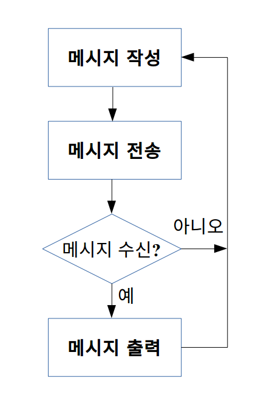
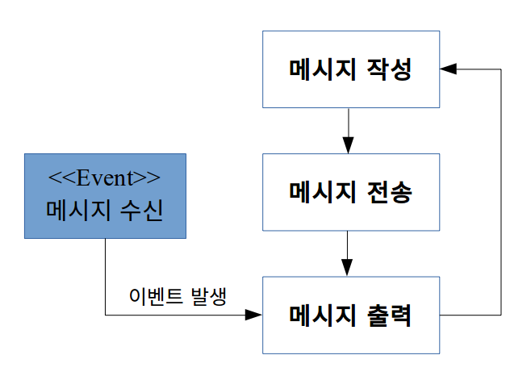
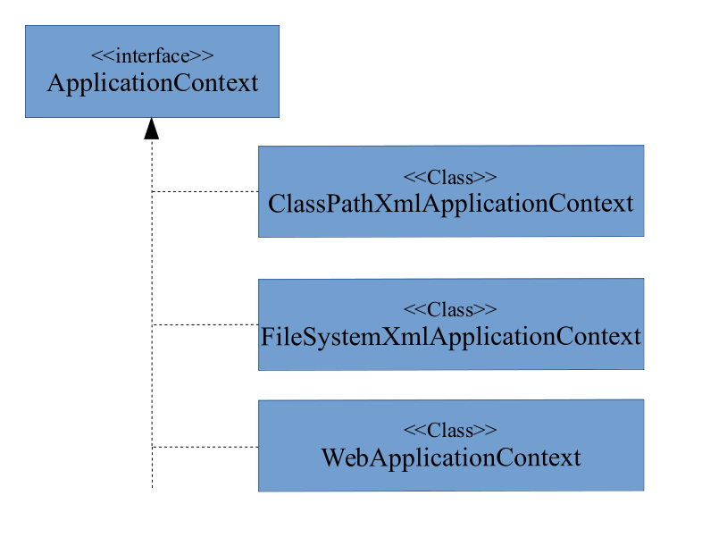

Chapter08_스프링_IoC_컨테이너(1)
=============================
- 스프링 IoC 컨테이너 사용 준비
- Gradle 빌드 파일 분석
- XML 기반 빈 관리 컨테이너
- 생성자와 프로퍼티 설정

---
스프링 IoC 컨테이너 사용 준비
-------------  

스프링 프레임워크에서는 빈 관리 컨테이너를 **IoC(Inversion of Control) 컨테이너**라고 한다.


- ###의존성 주입(DI)과 역제어(IoC)  
  의존성 주입을 일반적인 용어로 역제어(IoC; Inversion of Control)라고 한다. 즉 역제어(IoC)의 한 형태가 의존성 주입(DI)이다. 역제어란 개발자가 작성한 코드의 흐름에 따라 제어가 이루어지는 것이 아니라 외부에 의해 코드의 흐름이 바뀌는 것을 말한다.

  ####역제어 사례 1. 이벤트

    역제어의 대표적인 예로 이벤트(Event)가 있다. 카톡으로 메시지를 작성하고 있다고 가정한다. 일반적인 흐름이라면 메시지를 입력하고 전송 버튼을 누르면 상대편에게 메시지가 전달되고 상대편이 보낸 메시지가 있다면 화면에 출력 된다.

    

    하지만, 실제 카카오톡에선 메시지를 작성하는 중이라도 상대편으로부터 메시지를 받게 되면 즉시 메시지를 출력한다. 즉 외부에서 발생한 이벤트에 의해 코드 흐름이 바뀐다. 이것이 역제어다.

    

  ####역제어 사례 2. 의존성 주입

    역제어의 또 다른 예로 의존성 주입(DI, Dependecy Injection)이 있다. 예전에는 자신이 사용할 객체(의존 객체,Dependencies)는 자신이 직접 만들었다. 반대되는 방식이 의존성 주입이다. 즉 내부에서 생성하는 것이 아니라 외부에서 의존 객체를 주입 한다. 셋터 메서드를 통해 외부에서 객체를 주입하고, execute()로 외부에서 주입된 객체를 사용한다.

  - Gradle 및 Groovy 설치

---
Gradle 빌드 파일 분석
---------------------

Gradle 플러그인은 자주 사용할 만한 빌드 명령어를 미리 작성하여 묶어 놓은 일종의 라이브러리 이다.  

**<build.gradle>**
```gradle
apply plugin: 'java'
apply plugin: 'eclipse-wtp'
apply plugin: 'war'

compileJava.options.encoding = 'UTF-8'
sourceCompatibility = 1.7
version = '1.0'

eclipse {
  wtp {
    facet {
      facet name: 'jst.web', version: '3.0' // Servlet Spec Version 지정
      facet name: 'jst.java', version: '1.7' // Java Version 지정, 1.7 ...
    }
  }
}

jar {
  manifest {
    attributes 'Implementation-Title': 'Gradle Quickstart',
      'Implementation-Version': version
  }
}

repositories {
  mavenCentral()
}

dependencies {
  compile 'org.springframework:spring-context:4.0.3.RELEASE'
  compile group: 'commons-collections',
    name: 'commons-collections',
    version: '3.2'
  testCompile group: 'junit',
    name: 'junit',
    version: '4.+'
}

test {
  systemProperties 'property': 'value'
}

uploadArchives {
  repositories {
    flatDir {
      dirs 'repos'
    }
  }
}
```

####Gradle Java 플러그인
  - Java 플러그인 사용
    Java 플러그인 사용하려면 빌드 스크립트 파일에 다음 명령어를 추가해야 한다.
    ```
    apapply plugin: 'java'
    ```
  - 프로젝트 기본 폴더 구조

    |디렉토리|설명|
    |:-|:-|
    |src/main/java|자바 소스 파일을 두는 폴더|
    |src/main/resources|프로그램 실행 중에 참조하는 기타 파일을 두는 폴더|
    |src/test/java|단위 테스트를 위한 테스트 자바 소스 파일을 두는 폴더|
    |src/test/resources|단위 테스트를 위한 테스트 관련 기타 파일을 두는 폴더|

  - 주요 작업들
    |작업 이름|설명|
    |:-|:-|
    |compileJava|javac를 사용하여 자바 소스 파일을 컴파일한다 컴파일된 클래스 파일들은 build/classes/main 폴더에 둔다|
    |processResources|프로그램 실행 시에 참조하는 리소스 파일들을 build/resources/main 폴더로 복사한다|
    |classes|선행 작업: compileJava -> processResources, 클래스 및 리소스 파일을 모은다|
    |compileTestJava|선행작업: compileJava -> processResources -> classes, javac를 사용하여 테스트 자바 소스 파일을 컴파일 한다. 컴파일된 클래스 파일들은 build/classes/test 폴더에 둔다|
    |processTestResources|테스트 실핼시에 참조하는 리소스 파일들을 build/resources/test 폴더에 복사한다|
    |testClasses|선행 작업: compileTestJava -> processResources -> 테스트 클래스 및 테스트 리소스 파일을 모은다|
    |jar|선행 작업: compileJava -> processResources -> classes, 클래스 파일들과 리소스 파일들을 묶어 JAR 파일을 생성한다. 생성된 JAR 파일은 build/libs 폴더에 둔다|
    |javadoc|선행 작업: compileJava -> processResources -> classes, javadoc을 사용하여 API 문서를 생성한다. 생성된 문서 파일들을 build/docs/javadoc 폴더에 둔다||
    |test|선행 작업 : compileJava -> processResources -> classes -> compileTestJava -> processTestResources -> testClasses, JUnit 또는 TestNG를 사용하여 단위 테스트를 수행한다|
    |uploadArchives|선행 작업: compileJava -> processResources -> classes -> jar, 로컬 또는 원격 저장소에 JAR 파일을 업로드 한다|
    |clean|빌드 폴더(build)를 삭제한다|
    |assemble|선행 작업: compileJava -> processResources -> classes -> jar, 다른 아카이브 작업들이 있다면 모두 수행한다|
    |check|선행 작업:compileJava -> processResources -> classes->compileTestJava -> processTestResources -> testClasses ->test, 다른 검증 작업들이 있다면 모두 수행한다|
    |build|선행 작업:compileJava -> processResources -> classes -> jar -> assemble -> compileTestJava -> processTestResources -> testClasses ->test, 프로젝트의 모든 빌드 작업을 수행한다|

  - 주요 속성들
    |속성 이름|기본 값(실제경로)|설명|
    |:-|:-|:-|
    |buildDir|build ($projectDir/build)|빌드 파일들을 보관할 폴더 이름|
    |version|없음, 예) 1.0|빌드 버전을 지정. JAR 파일을 만들 때 사용됨, 예) Test-1.0.jar|
    |reportsDirName|reports ($buildDir/reports)|각종 보고서를 저장할 폴더 이름|
    |testReportsDirName|tests ($buildDir/reports/test)|테스트 결과 보고서를 저장할 폴더 이름|
    |libsDirName|libs ($buildDir/libs)|라이브러리 파일을 저장할 폴더 이름|
    |docsDirName|docs ($buildDir/docs)|생성된 문서를 저장할 폴더 이름|
    |sourceCompatibility|현재 사용하는 JVM 버전|자바 소스의 문법을 검사할 때 사용할 자바 버전|
    |targetCompatibility|sourceCompatibility 값|클래스 파일을 만들 때 사용할 자바 버전. 클래스를 실행할 때는 이 속성에 지정한 값과 같은 버전 또는 상위 버전의 JVM이 필요함|

- build.gradle 코드 분석
  ```
  sourceCompatibility = 1.7
  ```
  자바 1.7 버전의 문법에 따라 자바 소스를 검사하고, 컴파일할 때도 JVM 1.7 이상에서만 실행할 수 있게 하라는 설정
  ```
  version = '1.0'
  ```
  빌드 버전을 1.0으로 설정한다. JAR 파일을 생성할 때 파일명 뒤에 1.0이 붙는다.

####jar 작업과 제어 속성 - jar {}
  ajr 작업은 Java 플러그인에 속해 있으며 .jar 파일을 생성하는 일을 한다.
  - build.gradle 코드 분석
    ```gradle
    jar {
      manifest {
        attributes 'Implementation-Title': 'Gradle Quickstart',
          'Implementation-Version': version
      }
    }
    ```
    jar 작업을 수행할 때 MANIFEST.MF 파일에 들어갈 속성을 지정하고 있다. 빌드 수행 후, 생성된 JAR 파일을 풀어 보면 MANIFEST.MF 파일의 내용이 다음과 같다.
    ```
    JAR 파일: META-INF/MANIFEST.MF
    Manifest-Version: 1.0
    Implementation-Title: Gradle Quickstart
    Implementation-Version: 1.0
    ```

####의존 라이브러리를 가져올 저장소 설정 - repositories {}
  |메서드 이름|설명|
  |:-|:-|
  |flatDir()|로컬 폴더를 저장소로 지정|
  |ivy()|Apache Ivy 서버를 저장소로 지정|
  |jcenter()|Bintray의 jcenter 서버를 저장소로 지어|
  |mavenCentral()|Maven 중앙 서버를 저장소로 지정. 서버의 기본 URL은 http://repo1.maven.org/maven2/ 이다|
  |mavenLocal()|Maven 로컬 임시 보관소를 저장소로 지정|

  ```
  repositories {
    mavenCentral()
  }
  ```
  의존 라이브러리를 찾기 위한 저장소로 메이븐 중앙 서버를 지정

####프로젝트에서 사용할 의존 라이브러리 지정 - dependencies {}
  ```
  dependencies {
    [설정 이름] [의존 라이브러리 정보]
  }
  ```
  **'의존 설정 이름(dependency configuration name)'** 은 의존 라이브러리가 사용될 시점이다.
  |설정 이름|작업|설명|
  |:-|:-|:-|
  |compile|compileJava|compile 이름으로 등록한 라이브러리는 compileJava 작업을 수행할때 사용된다|
  |runtime||runtime 이름으로 등록한 라이브러리는 실행 시에 사용된다|
  |testCompile|compileTestJava|testCompile 이름으로 등록한 라이브러리는 compileTestJava 작업을 수행할 때 사용된ㄴ다. compileTestJava 작업은 compileJava 작업을 포함하고 있으므로, compile 이름으로 등록한 라이브러리는 제외하고 등록한다|
  |testRuntime|test|testRuntime 이름으로 등록한 라이브러리는 test 작업을 수행할 때 사용된다|
  |providedCompile||compile과 같다. 다만 .war 파일에는 포함되지 않는다|
  |providedRuntime||runtime과 같다. 다만 .war 파일에는 포함되지 않는다|

  표기법 1.
  ```
  [설정이름] 'group:name:version:classifier'
  ```

  표기법 2.
  ```
  [설정이름] group: '그룹명', name: '라이브러리 이름', version: '라이브러리 버전',
            classifier: '분류 접미사'
  ```

  라이브러리 정보에서 'name' 항목은 필수이다. 나머지는 선택 사항.
  ```
  dependencies {
    compile 'org.springframework:spring-context:4.0.3.RELEASE'
    compile group: 'commons-collections',
      name: 'commons-collections',
      version: '3.2'
    testCompile group: 'junit',
      name: 'junit',
      version: '4.+'
  }
  ```
  IoC 컨테이너를 사용하려면 'spring-context' 라이브러리가 있어야 한다. 이 라이브러리를 가져오기 위해 compile 이름으로 등록한다.

####Gradle Eclipse 플러그인
  ```
  apply plugin: 'eclipse-wtp'
  apply plugin: 'war'
  ```
  eclipse-wtp 플러그인과 war 플러그인을 사용한다.

---
XML 기반 빈 관리 컨테이너
------------------------
스프링 IoC 컨테이너는 두 가지 방법으로 빈 정보를 다룬다. **XML과 애노테이션이다.**

- ###ApplicationContext 인터페이스
  스프링은 IoC 컨테이너가 갖추어야 할 기능들을 ApplicationContext 인터페이스에 정의해 두었다.

  

  스프링에서 빈 정보는 XML 파일에 저장해 두고 ClassPathXmlApplicationContext 클래스나 FileSystemXmlApplicationContext 클래스를 사용하여 빈을 자동 생성한다. ClassPathXmlApplicationContext는 자바 클래스 경로에서 XML로 된 빈 설정 파일을 찾는다. FileSystemXmlApplicationContext는 파일 시스템 경로에서 빈 설정 파일을 찾는다. WebApplicationContext는 웹 애플리케이션을 위한 IoC 컨테이너로서 web.xml 파일에 설정된 정보에 따라 XML 파일을 찾는다.

- ###스프링 빈 컨테이너 ClassPathXmlApplicationContext 사용
  준비 사항  

  - Score 클래스 정의  
    빈 컨테이너에서 관리할 클래스 이렇게 값을 보관하는 용도로 사용하는 클래스를 '값 객체(Value Object)'라고 부른다.  

    <Score.java>
    ```java

    public class Score {
    	String 	name;
    	float		kor;
    	float		eng;
    	float		math;

    	public Score() { }

    	public Score(String name, float kor, float eng, float math) {
    		this.name = name;
    		this.kor = kor;
    		this.eng = eng;
    		this.math = math;
    	}

    	public float average() {
    		return sum() / (float)3;
    	}

    	public float sum() {
    		return kor + eng + math;
    	}

    	public String getName() {
    		return name;
    	}

    	public void setName(String name) {
    		this.name = name;
    	}

    	public float getKor() {
    		return kor;
    	}

    	public void setKor(float kor) {
    		this.kor = kor;
    	}

    	public float getEng() {
    		return eng;
    	}

    	public void setEng(float eng) {
    		this.eng = eng;
    	}

    	public float getMath() {
    		return math;
    	}

    	public void setMath(float math) {
    		this.math = math;
    	}

    }
    ```

  - 빈 설정 XML 파일 준비  
    애플리케이션에서 사용할 객체는 빈 설정 파일에 선언한다. 스프링 IoC 컨테이너는 빈 설정 파일에 선언된 대로 빈을 생성한다.
    ```
    <?xml version="1.0" encoding="UTF-8"?>
    <beans xmlns="http://www.springframework.org/schema/beans"
        xmlns:xsi="http://www.w3.org/2001/XMLSchema-instance"
        xsi:schemaLocation="http://www.springframework.org/schema/beans
            http://www.springframework.org/schema/beans/spring-beans.xsd">

      <bean id="score" class="exam.test01.Score"/>

    </beans>
    ```
    네임스페이스를 정의한 XML 스키마 파일의 위치를 지정한다.
    ```
    <bean id="score" class="exam.test01.Score"/>
    ```
    스프링 IoC 컨테이너가 생성할 자바 빈에 대한 정보는 <bean> 태그로 선언합니다. class 속성에는 클래스 이름을 지정한다. 반드시 패키지 이름을 포함한 클래스 이름(fully qualified name)이어야 한다. id 속성은 객체의 식별자이다. 빈 컨테이너에서 객체를 꺼낼 때 이 식별자를 사용한다.

  - 스프링 IoC 컨테이너 사용
    ```java
    public static void main(String[] args) {
		ClassPathXmlApplicationContext ctx =
				new ClassPathXmlApplicationContext("exam/test01/beans.xml");

		Score score = (Score) ctx.getBean("score");

		System.out.println("합계:" + score.sum());
		System.out.println("평균:" + score.average());
	  }
    ```

    ```java
    new ClassPathXmlApplicationContext("exam/test01/beans.xml");
    ```
    ClassPathXmlApplicationContext의 인스턴스를 생성할 때 생성자에 빈 설정 파일의 경로를 넘긴다.

  - ###name 속성으로 빈 이름 지정하기

    자바 빈을 선언할 때 id 속성 대신 name 속성에 빈 이름을 지정할 수 있다.

    |항목|id 속성|name 속성|
    |:-|:-|:-|
    |용도|빈 식별자를 지정한다. 중복되어선느 안된다|인스턴스의 별명을 추가할 때 사용한다. id와 마찬가지로 중복되어서는 안된다|
    |여러 개의 이름 지정|불가|콤마(,), 세미콜론(;)또는 공백을 사용하여 여러 개의 이름을 지정할 수 있다. 첫 번째 이름은 컨테이너에 빈을 보관할 때 사용되고, 나머지 이름은 빈의 별명이 된다|
    |빈 이름 작성 규칙|스프링 프레임워크 3.1 이전 버전은 몇몇 경우만 가능하지만 3.1 부터는 제약이 없다|제약 없다|

    - 익명 빈 선언

      설정 파일에서 빈을 선언할 때 빈의 이름을 지정하지 않을 수 있다. 이런 빈을 '익명(anonymous)빈'이라고 부른다. 빈의 이름을 지정하지 않으면 컨테이너에 보관할 때 "패키지 이름 + 클래스 이름 + #인덱스"를 빈의 이름으로 사용한다. 동일한 클래스의 객체가 여러 개 생성될 경우를 대비해 빈 이름 뒤에 '#인덱스'가 자동으로 붙는 것이다. 인덱스는 0부터 시작한다.

---
생성자와 프로퍼티 설정
--------------------
  - 빈을 선언 할때 <constructor-arg> 엘리먼트를 이용하면 호출된 생성자를 지정할 수 있다.  
    ```xml
    <constructor-arg><value type="java.lang.String">홍길동</value></constructor-arg>
    <constructor-arg><value>81</value></constructor-arg>
    <constructor-arg type="float" value="72"/>
    <constructor-arg value="98"/>
    <constructor-arg value="70" index="3"/>
    ```
    이와 같이 다양한 방식으로 작성 할 수 있다.

  - 프로퍼티 설정(beans.xml)
    ```xml
    <bean id="score1" class="exam.test05.Score">
      <property name="name"><value>홍길동</value></property>
      <property name="kor"><value>100</value></property>
      <property name="eng"><value>95</value></property>
      <property name="math"><value>90</value></property>
    </bean>

    <bean id="score2" class="exam.test05.Score">
      <property name="name" value="임꺽정"/>
      <property name="kor" value="85"/>
      <property name="eng" value="99"/>
      <property name="math" value="100"/>
    </bean>
    ```
    빈 설정 파일에서 인스턴스를 선언할 때 생성자처럼 프로퍼티 값을 설정할 수 있다. 프로퍼티 값을 지정할 때는 <propery>를 사용한다.

  - \<bean>의 속성을 이용하여 생성자 및 프로퍼티 설정하기
    ```xml
    <?xml version="1.0" encoding="UTF-8"?>
    <beans xmlns="http://www.springframework.org/schema/beans"
        xmlns:xsi="http://www.w3.org/2001/XMLSchema-instance"
        xmlns:p="http://www.springframework.org/schema/p"
        xmlns:c="http://www.springframework.org/schema/c"
        xsi:schemaLocation="http://www.springframework.org/schema/beans
            http://www.springframework.org/schema/beans/spring-beans.xsd">

      <bean id="score1" class="exam.test06.Score"
        p:name="홍길동" p:kor="100" p:eng="95" p:math="90"/>

      <bean id="score2" class="exam.test06.Score"
        c:name="임꺽정" c:kor="80" c:eng="90" c:math="100"/>
    </beans>
    ```
    \<bean>의 속성을 통해 프로퍼티 값을 설정하려면, \<beans> 시작 태그에 이를 위한 네임스페이스 "http://www.springframework.org/schema/p"를 선언해야 한다. 네임스페이스의 별명으로 프로퍼티를 의미하는 'p'를 사용한다.  
    생성자도 프로퍼티처럼 \<bean> 태그의 속성으로 매개변수 값을 설정할 수 있다. 네임스페이스 별명은 'c'(constructor, 생성자)를 사용한다. 꼭, c나 p를 사용할 필요는 없다.
