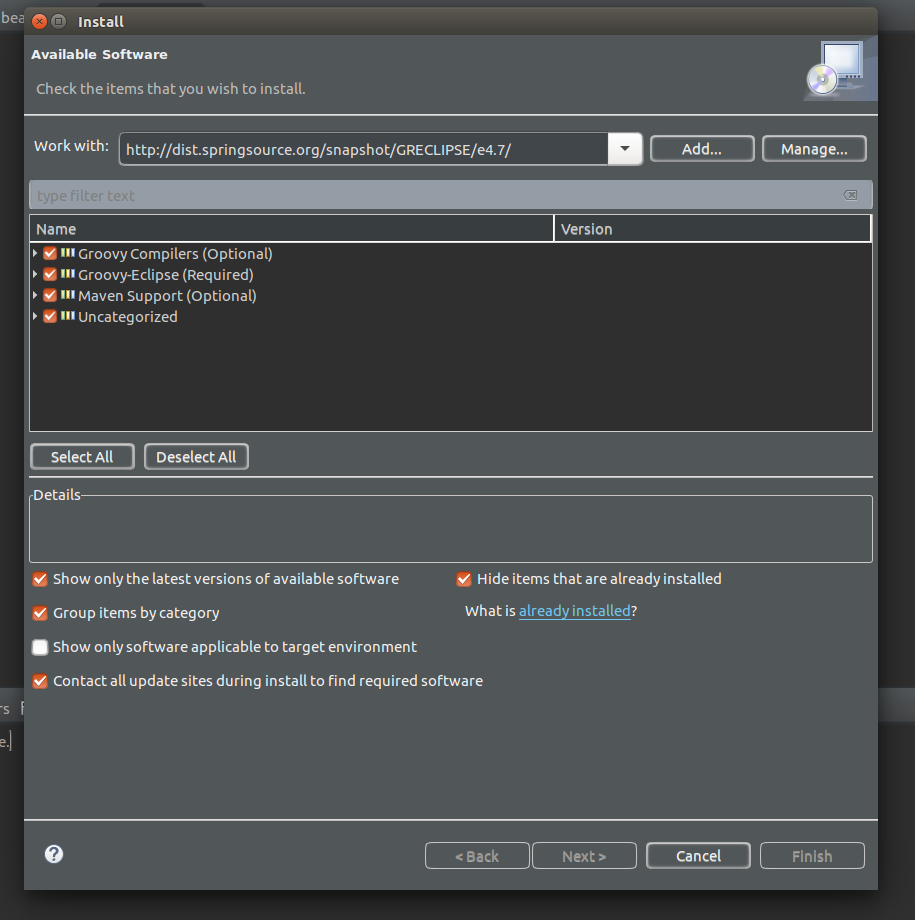

오늘 한일
========
- 자바 웹 개발 워크북 공부
  - 스프링 IoC 컨테이너 사용 준비
  - Gradle 빌드 파일 분석
  - XML 기반 빈 관리 컨테이너
  - 생성자와 프로퍼티 설정

- 이클립스 oxygen에서 groovy 설치하기  

  1. [여기](https://github.com/groovy/groovy-eclipse/wiki)서 본인에 맞는 버전의 링크를 복사(e4.6을 까니 잘 작동하고 있다.)
  

  2. 이클립스 혹은 sts에서 상단 [help] -> [Instal New Software..] 클릭

  3. 1에서 복사한 링크를 "Work with" 영역에 붙여 넣는다. 그러면 다운 받을 목록이 나오고 "Next" 버튼을 눌러 다운로드를 진행하면 된다.(다 받은후 "restart")
  

오늘 느낀점
=========
- 자바 웹 개발 워크북을 8장을 공부하면서 사전 준비로 Gradle과 Groovy를 깔아야 됐는데 책이 2014년에 쓴 것이다 보니 요즘 버전들이랑 달라서 잘 안됐다.  
~~좀 더 정확하게는 내가 쓰고 있던 이클립스 버전은 oxygen이고 책의 버전은 kepler이라 받아야하는 플러그인도 달랐고, 책에서는 Groovy사 "Pivotal"의 것을 쓰는데 해당 프로젝트가 몇년전에 drop 되었다.~~ **가장 큰 문제는 인터넷이였다!!** 경기문화창조허브에선 결국엔 끝까지 groovy를 깔지 못하고 왔었는데 지금 이 TIL을 작성하면서 혹시나 하고서 아까와 같은 방식으로 설치를 시도하니까 **5분만에 설치가 완료 되었다!!!** 해당 개발 환경을 셋팅한다고 경기문화창조허브에서 5시간 정도 소비해서 gradle만 겨우 완료 했는데 인터넷이 문제였다니....(계속 다운로드 도중 error가 떴는데 연결 얘기는 없었고 error문구가 너무 다양하게 길게 나와서 검색해도 나오지가 않았다.)그 덕에 공부도 많이 못했고, 생활코딩 강의는 못봤는데 말이다...ㅜㅜ 창조허브의 인터넷이 빠르진 않아도 문제가 느껴질 정도로 느리지도 않아서 해당 문제일 거라고 크게 의심 못했는데...앞으로는 개발환경 셋팅은 집에서 해야겠다.ㅜㅜ

- 그래도 이렇게 개발환경 셋팅하면서 한번에 손쉽게 되지 않고 이리 헤매고 저리 헤매면 자잘한 지식이 느는거 같기도 하고 담금질 한것 마냥 강해진 느낌이 난다. 그래도 공부 시간이 줄어 든건 너무 아깝다ㅜㅜ

내일 할일
========
- 카카오 코딩 테스트
- 자바 웹 개발 워크북 공부
