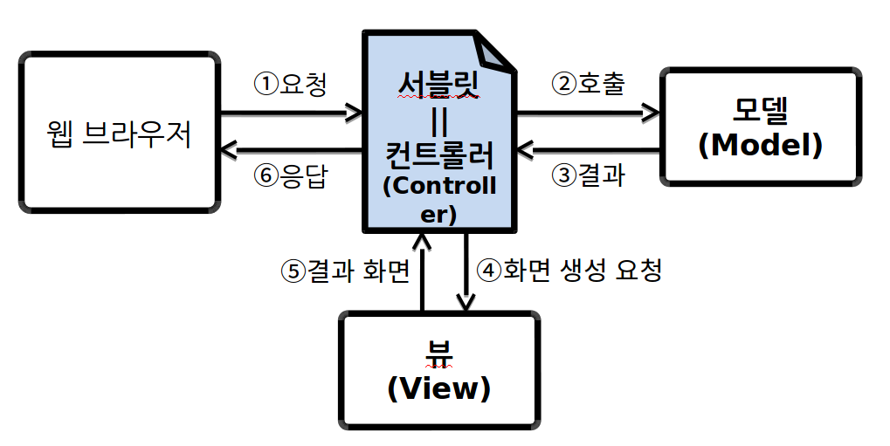
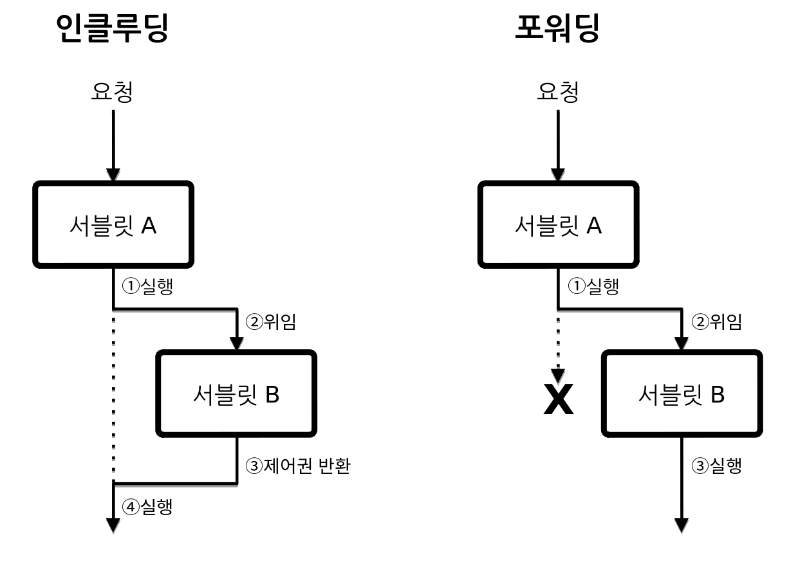

Chapter05 - MVC 아키텍처(1)
=========================
- MVC
- 뷰 컴포턴트와 JSP
- JSP의 주요 구성 요소
- 포워딩과 인클루딩
- 데이터 보관소(ServletContext, HttpSession, ServletRequest, JspContext)
---

MVC
-----
- **모델(model)** : 데이터 저장소와 연동하여 사용자가 입력한 데이터나 사용자에게 출력할 데이터를 다룬다.

- **뷰(view)** : 모델이 처리한 데이터나 그 작업 결과를 가지고 사용자에게 출력할 화면을 만든다.

- **컨트롤러(controller)** : 클라이언트의 요청을 받았을 때 그 요청에 대해 실제 업무를 수행하는 모델 컴포넌트를 호출 한다.

    

  **MVC 구조를 적용하면 올인원 방식에 비해 높은 재사용성과 융통성을 가진게 된다.**
---
뷰 컴포넌트와 JSP
----------------
- MVC 아키텍처에서 뷰 컴포넌트를 만들 때 보통 JSP를 사용(책 내용 기준)
- JSP 기술의 목적은 콘텐츠를 출력하는 코딩을 단순화
- JSP는 서블릿 자바 파일을 만들기 위한 템플릿으로 사용
- JSP를 실행 한 뒤 JSP 엔진이 서블릿을 만든다. 따라서 서블릿 소스를 확인하고 싶으면 먼저 JSP를 실행해야 한다.


```
<서블릿 소스 파일>

out.println("<html><head><title>회원 등록</title></head>");
out.println("<body><h1>회원 등록</h1>");
out.println("<form action='add' method='post'>");
out.println("이름: <input type='text' name='name'><br>");
out.println("이메일: <input type='text' name='email'><br>");
out.println("암호: <input type='password' name='password'><br>");
out.println("<input type='submit' value='추가'>");
out.println("<input type='reset' value='취소'>");
out.println("</form>");
out.println("</body></html>");
```
JSP를 사용하면 위와 HTML을 out.println()을 사용하여 출력하던 부분을 일반적인 HTML 형식으로 작성 할수 있다.  
```
<JSP 소스 파일>

<%@page import="spms.vo.Member"%>
<%@page import="java.util.ArrayList"%>
<%@ page
	language="java"
	contentType="text/html; charset=UTF-8"
    pageEncoding="UTF-8"%>
<!DOCTYPE html PUBLIC "-//W3C//DTD HTML 4.01 Transitional//EN"
	"http://www.w3.org/TR/html4/loose.dtd">
<html>
<head>
<meta http-equiv="Content-Type" content="text/html; charset=UTF-8">
<title>회원 목록</title>
</head>
<body>
<jsp:include page="/Header.jsp"/>
<h1>회원목록</h1>
<p><a href='add'>신규 회원</a></p>
<%
ArrayList<Member> members = (ArrayList<Member>)request.getAttribute(
								"members");
for(Member member : members) {
%>
<%=member.getNo()%>,
<a href='update?no=<%=member.getNo()%>'><%=member.getName()%></a>,
<%=member.getEmail()%>,
<%=member.getCreatedDate()%>
<a href='delete?no=<%=member.getNo()%>'>[삭제]</a><br>
<%} %>
<jsp:include page="/Tail.jsp"/>
</body>
</html>
```


  ***서블릿은 자바 코드에 HTML이 들어 가있는 느낌이고, JSP는 HTML에 자바가 들어가 있는 느낌이다.***

###HttpJspPage 인터페이스

- JSP 엔진은 JSP 파일로부터 서블릿 클래스를 생성할 때 HttpJspPage 인터페이스를 구현한 클래스를 만든다.  

  

- **jspInit()**  
  - jspInit()는 JSP 객체가 생성될 때 호출
  - 자동 생성된 서블릿 소스 코드 상에선 init()가 jspInit()를 호출
  - JSP 페이지에서 init()를 오버라이딩할 일이 있다면 init() 대신 **jspInit()를 오버라이딩**     

- **jspDestroy**
  - JSP 객체가 언로드(unload) 될 때 호출
  - destroy()가 호출될 때 jspDestroy()를 호출
  - destroy()대신 **jspDestroy()를 오버라이딩**

- **_jspService()**
  - 서블릿 컨테이너가 service()를 호출하면 service() 메세드 내부에서 이 메서드를 호출
---
JSP의 주요 구성 요소
==================
JSP를 구성하는 요소는 **템플릿 데이터**와 **JSP 전용 태그** 이 두가지로 나눌 수 있다.   

  - **템플릿 데이터** : 클라이언트로 출력되는 콘텐츠(예: HTML, 자바스크립트, JSON 등)

  - **JSP 전용 태그** : 특정 자바 명령문으로 바뀌는 태그

###<템플릿 데이터>  
  템플릿 데이터는 클라이언트로 출력되는 콘텐츠다. 즉 HTML이나 XML, 자바스크립트, 일반 텍스트 등을 말하며 템플릿 데이터를 작성하기 위한 별도의 문법은 없다.
  ```
  <!DOCTYPE html PUBLIC "-//W3C//DTD HTML 4.01 Transitional//EN"
  	"http://www.w3.org/TR/html4/loose.dtd">
  <html>
  <head>
  <meta http-equiv="Content-Type" content="text/html; charset=UTF-8">
  <title>회원 목록</title>
  </head>
  <body>
  <jsp:include page="/Header.jsp"/>
  <h1>회원목록</h1>
  <p><a href='add'>신규 회원</a></p>
  ```
위와 같이 그냥 문서 작성하듯이 클라이언트로 출력할 내용을 작성 하면 된다. **템플릿 데이터는 서블릿 코드를 생성할 때 출력문으로 바뀐다.**

###<JSP 전용 태그>
특정 자바 명령문으로 바뀌는 태그
- **지시자 :** JSP 지시자에는 page, taglib, include가 있다.
  ```
  <%@ page
    language="java"
    contentType="text/html; charset=URF-8"
    pageEncoding="UTF-8"%>

  (page 지시자: JSP 페이지와 관련된 속성을 정의할 때 사용하는 태그)
  ```  

- **스크립트릿 :** JSP 페이지 안에 자바 코드를 넣을 때는 스크립트릿 태그<% %> 안에 작성 한다.
  ```
  <%
  String v1 = "";
  String v2 = "";
  String result = "";
  String[] selected = {"", "", "", ""};

  //값이 있을 때만 꺼낸다.
  if (request.getParameter("v1") != null) {
  	v1 = request.getParameter("v1");
  	v2 = request.getParameter("v2");
  	String op = request.getParameter("op");

  	result = calculate(
  				Integer.parseInt(v1),
  				Integer.parseInt(v2),
  				op);
  	...
        }
  %>
  ```

  **이렇게 작성한 스크립트릿의 내용은 서블릿 파일을 생성할 때 그대로 복사 된다.**    


- **선언문 :** JSP 선언문 <%! %>은 서블릿 클래스의 멤버(변수나 메서드)를 선언할 때 사용한다.
  ```
  <%! 멤버 변수 및 메서드 선언 %>
  ```
  ```
    <%!
  private String calculate(int a, int b, String op) {
  	int r = 0;

  	if ("+".equals(op)) {
  		r = a + b;
    }
  	...
  	return Integer.toString(r);
  }
  %>
  ```
  **선언문은 _jspService() 메서드 안에 복사되는 것이 아니라, _jspService() 밖의 클래스 블록 안에 복사 된다.**  

- **표현식 :** 표현식은 문자열을 출력할 때 사용 한다. 표현식<%= %> 안에는 결과를 반환하는 자바 코드가 온다.
  ```
  <input type="text" name="v1" size="4" value="<%=v1%>">
  	<select name="op">
  		<option value="+" <%=selected[0]%>>+</option>
  		<option value="-" <%=selected[1]%>>-</option>
  ```
  **표현식과 스크립트릿으로 작성한 자바 코드는 _jspService() 메서드로 복사될 때 JSP 내장 객체를 선언한 문장 뒤에 온다.**

---
포워딩과 인클루딩 (Forwarding, Including)
-----------------
서블릿끼리 작업을 위임하는 방법
- 포워드 방식은 작업을 한 번 위임하면 다시 이전 서블릿으로 제어권이 돌아오지 않는다.
- 인클루드 방식은 다른 서블릿으로 작업을 위임한 후, 그 서블릿의 실행이 끝나면 다시 이전 서블릿으로 제어구너이 넘어온다.


```
<jsp:include page="인클루딩 할 서블릿/JSP의 URL"/>
<jsp:forward page="포워딩 할 서블릿/JSP의 URL"/>

ex)
    <jsp:include page="/Header.jsp"/>
```
**JSP를 사용하는 목적은 자바 코드의 작성을 최소화 하는 것이기 때문에, 굳이 자바 코드로 작성할 필요가 없다.**

---
데이터 보관소
------------
####(1) ServletContext 보관소  

  - 웹 애플리케이션이 시작 될 때 생성되어 웹 애플리케이션이 종료 될 때까지 유지 된다.

  - 이 보관소에 데이터를 보고나하면 웹 애플리케이션이 실행되는 동안에는 모든 서블릿이 사용할 수 있다.

  - JSP에서는 application 변수를 통해 이 보관소를 참조 한다.  

####(2) HttpSession 보관소
  - 클라이언트의 최초 요청 시 생성되어 브라우저를 닫을 때까지 유진 된다.  

  - 보통 로그인할 때 이 보관소를 초기화하고, 로그아웃하면 이 보관소에 저장된 값들을 비운다. 따라서 **이 보관소에 값을 보관하면 서블릿이나 JSP 페이지에 상관없이 로그아웃하기 전까지 계속 값을 유지할 수 있다.**

  - JSP에서는 application 변수를 통해 이 보관소를 참조 한다.

####(3) ServletRequest 보관소
  - 클라이언트의 요청이 들어올 때 생성되어, 클라이언트에게 응답 할 때까지 유지된다.

  - 이 보관소는 포워딩이나 인클루딩하는 서블릿들 사이에서 값을 공유할 때 유용하다.

  - JSP에서는 request 변수를 통해 이 보관소를 참조한다.

####(4) JspContext 보관소
  - JSP 페이지를 실행하는 동안만 유지된다.
  - JSP에서는 pageContext 변수를 통해 이 보관소를 참조한다.

####보관소에 값을 넣고 빼내는 방법은 모두 같다.
```
  보관소 객체.setAttribute(키, 값);    //값 저장
  보관소 객체.getAttribute(키);       //값 조회
```
