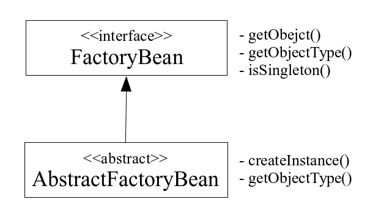

Chapter08_스프링_IoC_컨테이너(2)
=============================
- 의존 객체 주입
- 컬렉션 값 주입
- 팩토리 메서드와 팩토리 빈
- 빈의 범위 설정

---
의존 객체 주입
-------------  
어떤 객체가 작업을 수행하기 위해 다른 객체를 지속적으로 사용한다면 그 사용되는 객체를 의존 객체(depencencies)라 부른다. 보통 지속적으로 사용할 객체는 프로퍼티에 보관한다.

- 의존 객체 주입하기(beans.xml 빈 설정 파일)
  ```xml
  <?xml version="1.0" encoding="UTF-8"?>
  <beans xmlns="http://www.springframework.org/schema/beans"
      xmlns:xsi="http://www.w3.org/2001/XMLSchema-instance"
      xmlns:p="http://www.springframework.org/schema/p"
      xmlns:c="http://www.springframework.org/schema/c"
      xsi:schemaLocation="http://www.springframework.org/schema/beans
          http://www.springframework.org/schema/beans/spring-beans.xsd">

    <bean id="engine1" class="exam.test07.Engine"
        c:maker="Hyundai" p:cc="1998"/>

    <bean id="car1" class="exam.test07.Car">
        <property name="model"><value>Avante</value></property>
        <property name="engine"><ref bean="engine1"/></property>
    </bean>

    <bean id="car2" class="exam.test07.Car">
        <property name="model" value="Sonata"/>
        <property name="engine" ref="engine1"/>
    </bean>

    <bean id="car3" class="exam.test07.Car"
        p:model="Grandeur" p:engine-ref="engine1"/>

    <bean id="car4" class="exam.test07.Car"
        c:model="Equus" c:engine-ref="engine1"/>
  </beans>
  ```
  c:maker 속성은 maker라는 이름의 매개변수가 있는 생성자를 호출하라는 의미. p:cc 속성은 빈에 대해 'cc' 프로퍼티 값을 1998로 설정하라는 뜻이다. engine 프로퍼티 값은 Engine의 레퍼런스이어야 하며 이를 위해 <ref> 태그를 사용한다. 빈의 아이디 또는 이름, 별명을 지정한다. 만약 프로퍼티 값을 지정할때 문자열이나 자바 기본 타입에 해당하는 값은 value 속성을 사용하여 설정한다. 빈의 레퍼런스를 설정할 때는 ref 속성을 사용.
  ```xml
  <bean id="car4" class="exam.test07.Car"
      c:model="Equus" c:engine-ref="engine1"/>
  ```
  'c' 네임스페이스 속성을 사용하여 생성자 매개변수 값을 지정한다. 매개변수 이름 뒤에 '-ref'가 붙으면 빈의 레퍼런스 주소를 설정하겠다는 뜻이다.
- main 문
  ```java
  public static void main(String[] args) {
    ClassPathXmlApplicationContext ctx =
        new ClassPathXmlApplicationContext("exam/test07/beans.xml");

    Car car1 = (Car) ctx.getBean("car1");
    System.out.println(car1);

    Engine engine = (Engine) ctx.getBean("engine1");
    engine.cc = 3000;

    System.out.println(car1);

    Car car2 = (Car) ctx.getBean("car2");
    System.out.println(car2);

    Car car3 = (Car) ctx.getBean("car3");
    System.out.println(car3);

    Car car4 = (Car) ctx.getBean("car4");
    System.out.println(car4);
  }
  ```

- 실행 결과
  ```
    [Car:Avante
    [Engine:Hyundai,1998]
  ]
  [Car:Avante
    [Engine:Hyundai,3000]
  ]
  [Car:Sonata
    [Engine:Hyundai,3000]
  ]
  [Car:Grandeur
    [Engine:Hyundai,3000]
  ]
  [Car:Equus
    [Engine:Hyundai,3000]
  ]
  ```
  'engine1'을 꺼내어 배기량을 변경 하면 'engine1' 객체를 모든 car가 공유하기 때문에, 나머지 객체의 출력 결과의 배기량이 3000으로 변경 된다.

- ####개별 인스턴스 주입하기  
  프로퍼티에 의존 객체를 주입할 때 이미 존재하는 빈을 주입하는 것이 아닌, 새로 빈을 만들어 주입한다.
  ```xml
  <?xml version="1.0" encoding="UTF-8"?>
  <beans xmlns="http://www.springframework.org/schema/beans"
  	xmlns:xsi="http://www.w3.org/2001/XMLSchema-instance"
  	xmlns:p="http://www.springframework.org/schema/p"
  	xmlns:c="http://www.springframework.org/schema/c"
  	xsi:schemaLocation="http://www.springframework.org/schema/beans
          http://www.springframework.org/schema/beans/spring-beans.xsd">

  	<bean id="car1" class="exam.test08.Car">
  		<constructor-arg value="Avante" />
  		<constructor-arg>
  			<bean class="exam.test08.Engine" p:maker="Hyundai" p:cc="1495" />
  		</constructor-arg>
  	</bean>

  	<bean id="car2" class="exam.test08.Car">
  		<property name="model" value="Sonata" />
  		<property name="engine">
  			<bean class="exam.test08.Engine" p:maker="Hyundai" p:cc="1997" />
  		</property>
  	</bean>
  </beans>
  ```
  생성자 매개변수를 설정할 때 새로 빈을 생성하여 할당하고 싶다면 <contructor-arg>의 자식 태그로 <bean>을 선언하면 된다. 새로 생성된 빈은 매개변수로 전달될 것이기 때문에 빈의 아이디나 이름을 설정하지 않는다.  
  프로퍼티도 생성자 매개변수처럼 새로 빈을 만들어 할당할 수 있다. <property>의 자식 태그로 <bean>을 선언한다.

---
컬렉션 값 주입
--------------
- ####배열 프로퍼티의 값 주입

    <beans.xml>
    ```xml
    <?xml version="1.0" encoding="UTF-8"?>
    <beans xmlns="http://www.springframework.org/schema/beans"
    	xmlns:xsi="http://www.w3.org/2001/XMLSchema-instance"
    	xmlns:p="http://www.springframework.org/schema/p"
    	xmlns:c="http://www.springframework.org/schema/c"
    	xsi:schemaLocation="http://www.springframework.org/schema/beans
            http://www.springframework.org/schema/beans/spring-beans.xsd">

    	<bean id="car1" class="exam.test09.Car">
    		<constructor-arg value="Avante" />
    		<constructor-arg>
    			<bean class="exam.test09.Engine" p:maker="Hyundai" p:cc="1495" />
    		</constructor-arg>
    		<property name="tires">
    			<list>
    				<bean class="exam.test09.Tire" p:maker="Kumho" p:spec="P185/65R14" />
    				<bean class="exam.test09.Tire" p:maker="Kumho" p:spec="P185/65R14" />
    				<bean class="exam.test09.Tire" p:maker="Hankook" p:spec="P205/65R14" />
    				<bean class="exam.test09.Tire" p:maker="Hankook" p:spec="P205/65R14" />
    			</list>
    		</property>
    	</bean>
    </beans>
    ```
    배열이나 리스트에 간단한 상수값을 추가할 때는 <value>를 사용한다. 다른 빈의 레퍼런스를 추가할 때는 <ref>를 사용한다. null 값을 넣을 때는 <null>, 빈을 새로 만들어 넣을 때는 <bean>을 사용한다.

- ####Map과 Properties 값 주입

  <beans.xml>
  ```xml
  <?xml version="1.0" encoding="UTF-8"?>
  <beans xmlns="http://www.springframework.org/schema/beans"
  	xmlns:xsi="http://www.w3.org/2001/XMLSchema-instance"
  	xmlns:p="http://www.springframework.org/schema/p"
  	xmlns:c="http://www.springframework.org/schema/c"
  	xsi:schemaLocation="http://www.springframework.org/schema/beans
          http://www.springframework.org/schema/beans/spring-beans.xsd">

  	<bean id="spareTire" class="exam.test10.Tire">
  		<property name="maker" value="Hyundai" />
  		<property name="spec">
  			<props>
  				<prop key="width">205</prop>
  				<prop key="ratio">65</prop>
  				<prop key="rim.diameter">14</prop>
  			</props>
  		</property>
  	</bean>

  	<bean id="car1" class="exam.test10.Car">
  		<constructor-arg value="Avante" />
  		<constructor-arg>
  			<bean class="exam.test10.Engine" p:maker="Hyundai" p:cc="1495" />
  		</constructor-arg>
  		<property name="options">
  			<map>
  				<entry>
  					<key>
  						<value>sunroof</value>
  					</key>
  					<value>yes</value>
  				</entry>
  				<entry key="airbag" value="dual" />
  				<entry key="sparetire">
  					<ref bean="spareTire" />
  				</entry>
  			</map>
  		</property>
  	</bean>
  </beans>
  ```
  java.util.Properties 타입의 값을 설정할 때는 <props> 태그를 사용한다. Properties에 저장할 항목은 <prop> 태그로 정의한다. <prop>의 key 속성에는 문자열로 된 식별자가 들어가고, <prop>와 </prop> 사이에는 상수값이 들어간다.  

  **Map과 Properties의 관계**  
  java.util.Properties 클래스도 Map의 일종(Map 인터페이스를 구현하였음)이지만 주로 문자열로 된 식별자와 값을 다룰 때 사용한다.

---
팩토리 메서드와 팩토리 빈
------------------------
객체 지향 설계 기법 중에서 **팩토리 메서드(factory method) 패턴**과 **빌더(Builder) 패턴**이 있다. 공장 역할을 하는 객체를 통해 필요한 인스턴스를 간접적으로 얻는 방식이다.  

팩토리 메서드를 만드는 두 가지 방법이 있다. 스태틱으로 선언하여 클래스 메서드로 만들거나 인스턴스 메서드로 만드는 것이다.  

- ####스태틱 팩토리 메서드를 이용한 간접 객체 생성  
  <TireFactory.java>
  ```java

  import java.text.SimpleDateFormat;
  import java.util.Properties;

  public class TireFactory {
  	public static Tire createTire(String maker) {
  		if (maker.equals("Hankook")) {
  			return createHankookTire();
  		} else {
  			return createKumhoTire();
  		}
  	}

  	private static Tire createHankookTire() {
  		Tire tire = new Tire();
  		tire.setMaker("Hankook");

  		Properties specProp = new Properties();
  		specProp.setProperty("width", "205");
  		specProp.setProperty("ratio", "65");
  		specProp.setProperty("rim.diameter", "14");
  		tire.setSpec(specProp);

  		SimpleDateFormat dateFormat = new SimpleDateFormat("yyyy-MM-dd");
  		try {
  			tire.setCreatedDate(dateFormat.parse("2014-5-5"));
  		} catch (Exception e) {}

  		return tire;
  	}

  	private static Tire createKumhoTire() {
  		Tire tire = new Tire();
  		tire.setMaker("Kumho");

  		Properties specProp = new Properties();
  		specProp.setProperty("width", "185");
  		specProp.setProperty("ratio", "75");
  		specProp.setProperty("rim.diameter", "16");
  		tire.setSpec(specProp);

  		SimpleDateFormat dateFormat = new SimpleDateFormat("yyyy-MM-dd");
  		try {
  			tire.setCreatedDate(dateFormat.parse("2014-3-1"));
  		} catch (Exception e) {}

  		return tire;
  	}
  }
  ```

  <beans.xml>
  ```xml
  <?xml version="1.0" encoding="UTF-8"?>
      <beans xmlns="http://www.springframework.org/schema/beans"
      xmlns:xsi="http://www.w3.org/2001/XMLSchema-instance"
      xmlns:p="http://www.springframework.org/schema/p"
      xmlns:c="http://www.springframework.org/schema/c"
      xsi:schemaLocation="http://www.springframework.org/schema/beans
            http://www.springframework.org/schema/beans/spring-beans.xsd">

      <bean id="hankookTire" class="exam.test11.TireFactory"
          factory-method="createTire">
          <constructor-arg value="Hankook" />
      </bean>

      <bean id="kumhoTire" class="exam.test11.TireFactory"
          factory-method="createTire">
          <constructor-arg value="Kumho" />
      </bean>
  </beans>
  ```
  factory-method 속성에 인스턴스를 생성할 메서드 이름을 넣는다. factory-method 속성에는 반드시 static 메서드 이름을 지정해야 한다. 팩토리 메서드에 넘겨 줄 매개변수 값은 <constructor-arg> 태그로 설정한다.  

- ####인스턴스 팩토리 메서드를 이용한 간접 객체 생성  
  <TireFactory.java>
  ```java
  import java.text.SimpleDateFormat;
  import java.util.Properties;

  public class TireFactory {
  	public Tire createTire(String maker) {
  		if (maker.equals("Hankook")) {
  			return createHankookTire();
  		} else {
  			return createKumhoTire();
  		}
  	}

  	private Tire createHankookTire() {
  		Tire tire = new Tire();
  		tire.setMaker("Hankook");

  		Properties specProp = new Properties();
  		specProp.setProperty("width", "205");
  		specProp.setProperty("ratio", "65");
  		specProp.setProperty("rim.diameter", "14");
  		tire.setSpec(specProp);

  		SimpleDateFormat dateFormat = new SimpleDateFormat("yyyy-MM-dd");
  		try {
  			tire.setCreatedDate(dateFormat.parse("2014-5-5"));
  		} catch (Exception e) {}

  		return tire;
  	}

  	private Tire createKumhoTire() {
  		Tire tire = new Tire();
  		tire.setMaker("Kumho");

  		Properties specProp = new Properties();
  		specProp.setProperty("width", "185");
  		specProp.setProperty("ratio", "75");
  		specProp.setProperty("rim.diameter", "16");
  		tire.setSpec(specProp);

  		SimpleDateFormat dateFormat = new SimpleDateFormat("yyyy-MM-dd");
  		try {
  			tire.setCreatedDate(dateFormat.parse("2014-3-1"));
  		} catch (Exception e) {}

  		return tire;
  	}
  }
  ```
  앞선 코드에서 static 선언을 제거한다.

  <beans.xml>
  ```xml
  <bean id="tireFactory" class="exam.test12.TireFactory"/>

	<bean id="hankookTire" factory-bean="tireFactory" factory-method="createTire">
		<constructor-arg value="Hankook" />
	</bean>

	<bean id="kumhoTire" factory-bean="tireFactory" factory-method="createTire">
		<constructor-arg value="Kumho" />
	</bean>
  ```
  createTire()가 인스턴스 메서드가 되었기 때문에 이 메서드를 호출하려면 TireFactory 객체가 필요하다.  
  factory-bean 속성에 팩토리 객체(tireFactory)를 지정한다. class 속성은 설정하지 않는다. factory-method 속성에는 인스턴스 팩토리 메서드 이름을 지정한다.

- ####스프링 규칙에 따라서 팩토리 빈 만들기  
  - **팩토리 클래스 생성**  
    스프링에서는 팩토리 빈이 갖추어야 할 규칙을 org.springframework.beans.factoryFactoryBean 인터페이스에 정의 하였다. 팩토리 클래스를 만들 때 이 규칙에 따라 메서드를 구현하면 된다.  

    보통 FactoryBean 인터페이스를 직접 구현하기보다는 스프링에서 제공하는 추상 클래스를 상속해서 만든다.

    
    AbstractFactoryBean 클래스는 제너릭(generic) 문법이 적용된 클래스이다. AbstractFactoryBean에는 createInstance()라는 추상 메서드가 있는데, 이는 빈을 생성할 때 팩토리 메서드로서 getObject()가 호출되면 getObject()는 내부적으로 바로 이 메서드를 호출한다.  
    getObject()는 팩토리 메서드가 생성하는 객체의 타입을 알려준다.  

    <beans.xml>
    ```xml
    <bean id="hankookTire" class="exam.test13.TireFactoryBean">
		<property name="maker" value="Hankook" />
  	</bean>

    <bean id="kumhoTire" class="exam.test13.TireFactoryBean">
      <property name="maker" value="Kumho" />
    </bean>
    ```
    팩토리 역할을 할 메서드를 지정할 필요가 없다. class 속성에 주어진 클래스가 FactoryBean 타입의 클래스이면 이 클래스의 인스턴스를 보관하는 것이 아니라 이 클래스가 생성한 빈을 컨테이너에 보관한다.  

    스프링 IoC 컨테이너는 팩토리 빈에게 인스턴스를 만들어 달라고 요청(getObject() 호출)한다. 팩토리 빈은 우리가 구현한 createInstance()를 호출하여 createInstance()가 생성해 준 인스턴스를 그대로 컨테이너에게 반환한다.

---
빈의 범위 설정
------------
스프링 IoC 컨테이너는 빈을 생성할 때 기본적으로 한 개만 생성한다. getBean()을 호출하면 계속 동일한 객체를 반환한다. 그러나 설정을 통해 이런 빈의 생성 방식을 조정할 수 있다.

  |범위|설명|
  |-|-|
  |싱글턴(singleton)|오직 하나의 빈만 생성한다(기본설정)|
  |프로토타입(prototype)|getBean()을 호출할 때마다 빈을 생성한다.|
  |요청(request)|HTTP 요청이 발생할 때마다 생성되며, 웹 애플리케이션에서만 이 범위를 설정할 수 있다.|
  |세션(session)|HTTP 세션이 생성될 때마다 빈이 생성되며, 웹 애플리케이션에서만 이 범위를 설정할 수 있다.|
  |전역 세션(globalsession)|전역 세션이 준비될 때 빈이 생성된다. 웹 애플리케이션에서만 이 범위를 지정할 수 있으며, 보통 포틀릿 컨텍스트에서 사용한다.|

  <beans.xml>
  ```xml
  <bean id="hyundaiEngine" class="exam.test14.Engine"
	    p:maker="Hyundai" p:cc="1997"/>

	<bean id="kiaEngine" class="exam.test14.Engine"
	    p:maker="Kia" p:cc="3000"
	    scope="prototype"/>
  ```
  'scope' 속성의 값에 따라 범위가 설정된다. 빈의 범위를 설정하지 않으면 'singletone'이 기본 범위로 지정된다.
